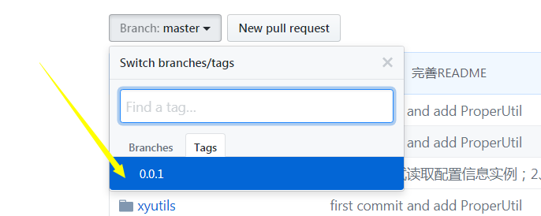

# 工具类
* 为自己服务
* 便于记忆使用

# How to use
最好用最新版本：到tag那去查询




```

compile 'com.github.xieyang94:xyutils:0.0.1'

```


# Version
[VERSION.md](https://github.com/xieyang94/xyutils/blob/master/VERSION.md)


# Thank
* Every


